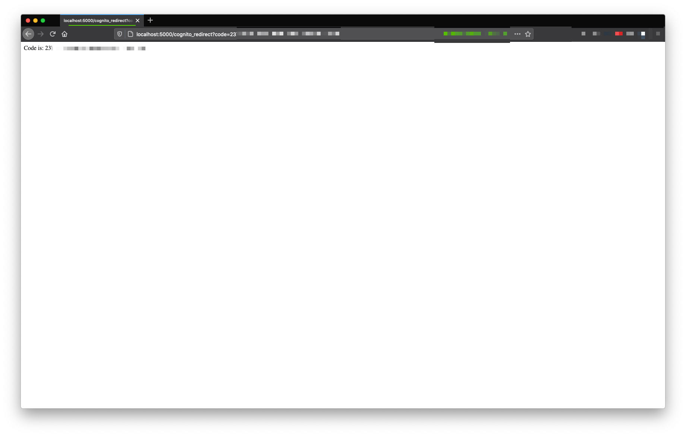

# 2021-03-27 - Flask with Amazon Cognito

- Example to answer a Stackoverflow question: https://stackoverflow.com/questions/66668865/aws-cognito-flask-app-cant-grab-the-jwt-from-the-url/66706380#66706380

🚨🚨🚨 IMPORTANT 🚨🚨🚨

The OAuth redirect will happens **only if the user signing in is confirmed**. You need to use one of the two options:

1. Use the default email verification with Cognito (e.g. sending a code to a real/valid email)
2. Auto confirm the user with a lambda on the "pre signup" trigger

This repository is using option 1.

### Running Flask App

```
pip install flask
export FLASK_APP=app.py && flask run
 * Running on http://127.0.0.1:5000/
```

### Template Deploy

To deploy [AWS CloudFormation](https://aws.amazon.com/cloudformation/):

```bash
# running aws-cli like that, it will look for the "default" profile in `~/.aws/credentials`
aws cloudformation deploy \
  --template-file template.yaml \
  --stack-name FlaskWithCognito
```

### Reference

Amazon Cognito User Pool Domain pattern:

```
https://${DomainName}.auth.${AwsRegion}.amazoncognito.com
```

Amazon Cognito OAuth Server URL:

```
https://${DomainName}.auth.${AwsRegion}.amazoncognito.com/login
?client_id=${UserPoolClientID}
&response_type=${code-or-token}
&scope=${whatever-scopes-you-require}
&redirect_uri=${CallbackUrlYouDefined}
```

- The `response_type` accepts either the value `code` or `token`, based on the OAuth flow your application requires
- `code` is the most common and requires your app to exchange the returned guid-like code for bearer tokens (ID, Access, Refresh)
- `token` represents the implicit flow and returns the bearer tokens directly to your application
- The `redirect_uri` must be allowed in the Amazon Cognito configuration. You can specify the value via the `CallbackURLs` property under the `CognitoUserPoolClientWebApplication` (line 35 in the [template.yaml](./template.yaml)).

Here’s a full example from the CloudFormation Template:

```
https://${DomainName}.auth.${AwsRegion}.amazoncognito.com/login
?client_id=${UserPoolClient}
&response_type=code
&scope=email+openid+profile
&redirect_uri=http://localhost:5000/cognito_redirect
```

After you register a new user in the Amazon Cognito url above, it will redirect you to:

```bash
# the pattern is:
<redirect_uri>?code=XXXX-XXXX-XXXX-XXXX
# the redirect_uri is configured in the user pool client
```

based on the example above, we have:

```
http://localhost:5000/cognito_redirect?code=XXXX-XXXX-XXXX-XXXX
```

You app (or the Flask app in this repository), will be running at `localhost:5000` with a route called `/cognito_redirect`

### Screenshots

- Amazon Cognito redirect will append a `code` query string in the redirect url


